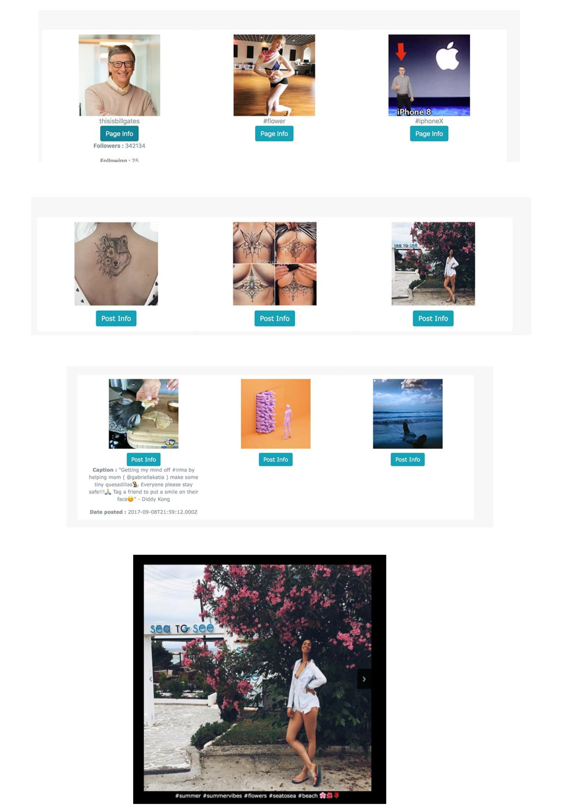

# Instagram-Crawler
This project we cover several segments of data collection on Instagram and their presentation 

* Python script solution that captures/crawls data from Instagram.
* Inserting the collected Instagram profile information in the database. 
* View and filter the data on a simple WEB site in Django Framework.
* Practical application

## INSTALLATION REQUIREMENTS
 
* Install Python 3.6.0
* Install the Pip Package, type in the command line:
  
  ```python get-pip.py```
* Install Pip requests (This will install Django and Selenium frames)
  
  ```cd * PATH * / Project```
  
  ```pip install -r requirements.txt```
* Install Firefox Client (you can download the famous Mozilla Firefox browser)
* Completed


## SETTING UP THE WEB SYSTEM
* If you want to use the web system, then you need to deploy the entire Django system in the database. We do this with the following code:

  ```cd * PATH * / Project / web. / manage.py makemigrations```

This will perform the migrations from the model. /manage.py migrate Convert migrations from a model to a base

* Default user/admin access : 
 
  * user : admin
  * password : admin
  
* To create a Super Administrator who has all the privileges, type:

  ```./manage.py createsuperuser```

Enter the fields that are required.

* To turn on the server, run the following command and activate the Django Web application at port 8000

  ```./manage.py runserver 8000```
  
  

## INSTRUCTIONS FOR USING THE CRAWL SCRIPT
Using the script to collect data is too simple, here is the full API with which you can serve.

***Warning! Before you start using any kind of service from the crawler, you must configure the authentication Instagram user 
that will be used for crawling the data which is visible only for authenticated users***

* Go to Project / script / settings.py
* Change Authentication info 

  ***Default is : username = "kiril_cvetkov" password = "*******"***
* Enter your username and password through which the browser will log in.
 
Once we have configured our sniffer, Below is the full API as well as an example to give a complete picture of how the script can be used

```
crawl.py [-db EXPORT_DB] [-DIR DIRECTORY] [-page PAGE_NAME] [-more MORE_DETAILS] [-num POST_NUMBER]
 
* [-db EXPORT_DB] Whether to save data in a database or only in a file system
* [-DIR DIRECTORY]: Directory where the data will be stored
* [-page PAGE_NAME]: Profile / crawling page
* [-more MORE_DETAILS]: Retrieve more details, such as a number of likes, description of pictures within a single photo
```

### Example 
First go to the directory where the script is located

 ```cd * PATH * / Project / script```

In order to run the script, and to crawl the data from Bill Gates's page :) , please type :

```python crawl.py -num = 30 -page = thisisbillgates -more -db```

## Web features
You can see all the pages that are indexed by our searcher

* You can filter images that contain a keyword on the page name or you can search by keywords contained in their description 
* You can click a specific image and list it in a gallery
* You can modify the data through the administration panel To access the admin section, type the following URL

  ***localhost:8000/admin***
  
### Visualization


## Usage
The biggest usage on such a defined and implemented architecture is that data retrieval can bring us enormous power today, especially in the field of ***Big Data***, ***Deep Learning*** and other ***Machine Learning algorithms***.
If we search for images with certain hashtags, then the system gives us images that logically contain the same hashtag. We can only imagine how Instagram uses hashtags to train a system to recognize various events, objects, events, articles, models in real time.
But with the usage of this script, all information is available to us if we know how to take them. Web browsers and Web retrieval is a powerful capability that every developer and business analyst needs to have.

